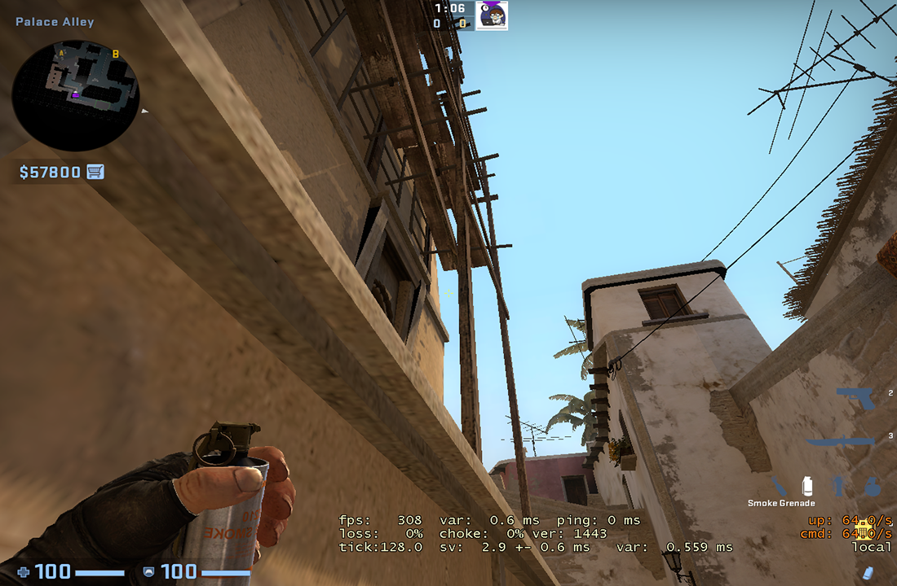

# CSGOUtilities

#### PT-BR

## 🔧 Funções:

- Criar, listar, alterar e deletar.

## Requisitos:

- Node.js
- Postgres (se você tiver Docker, basta executar o comando <code>docker compose up -d</code>)
- executar as migrations com o comando: <code>npm run typeorm migration:run</code>
- Excluir a extensão ".example" do arquivo ".env.example"
- Executar o script "dev": <code>npm run dev</code>

---

# CSGOUtilities

#### EN-US

## 🔧 Functions:

- Create, Read, Update, Delete

## Requirements:

- Node.js
- Postgres server (if you have Docker installed, use the command <code>docker compose up -d</code>)
- Execute the migrations running: <code>npm run typeorm migration:run</code>
- Delete the extension ".example" of ".env.example"
- Execute "dev" script: <code>"npm run dev"</code>
